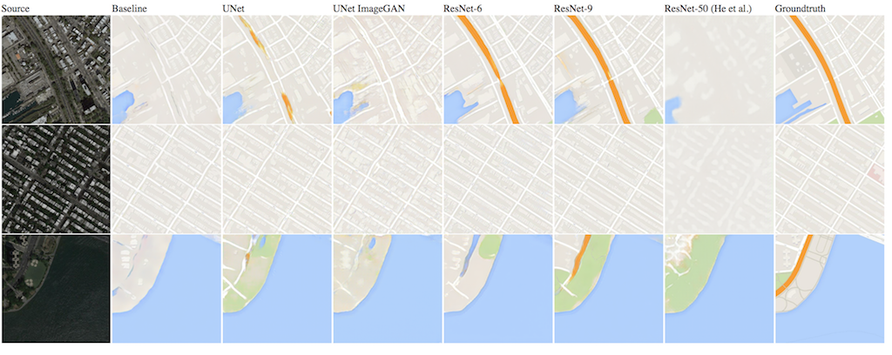
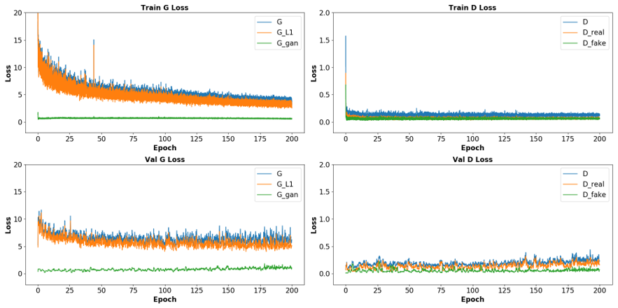
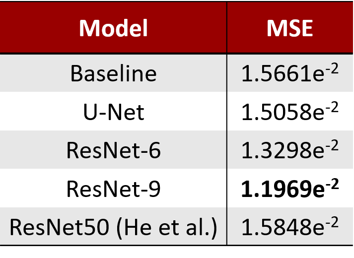
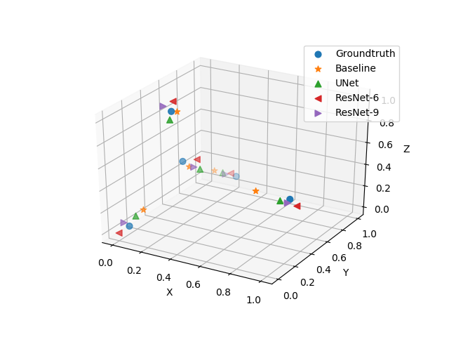

# Pix2pix in Pytorch
This project is based on [Image-to-Image Translation with Conditional Adversarial Networks](https://arxiv.org/pdf/1611.07004v1.pdf).




## Prerequisites
- Python 3.6.x
- [PyTorch 0.4.x & torchvision](http://pytorch.org/)


## Dataset
Maps dataset can be downloaded from original project [CycleGAN and pix2pix in PyTorch](https://github.com/junyanz/pytorch-CycleGAN-and-pix2pix).
Should choose the CycleGAN one in the format of

    .
    ├── datasets
    |   ├── maps
    |   |   ├── trainA             # Training
    |   |   ├── trainB
    |   |   ├── valA               # Validation
    |   |   ├── valB
    |   |   ├── testA              # Test
    |   |   ├── testB


## Training

### Train model from scratch

```bash
python main.py --mode train --data_dir [data_directory] --n_epoch 200 --G resnet9 --gan_loss MSE
```
Default ```data_dir``` is ```./datasets/maps/```. Source (A) and target (B) images should be in folders trainA/trainB, valA/valB, testA/testB separately.

### Continue train using pretrained model
```bash
python main.py --mode train --pretrain_path ./checkpoints/xxx/xxx.pt
```
Need to provide same configs/options when continue to train a model.

### Plot loss stats from train.json
```bash
python plot.py --dir ./checkpoints/xxx
```
It will look for train.json in the directory and output plots as result.png.

Loss:


### See more options available
```bash
python main.py -h
```

## Testing
```bash
python main.py --mode test --pretrain_path ./checkpoints/xxx/xxx.pt
```
This generates all images from test set and save them to ./checkpoints/xxx/images/test/.


Mean Squared Error of generated images:
<br/><br/>


t-SNE plot of 5 random generated images from different models and ground truth:

